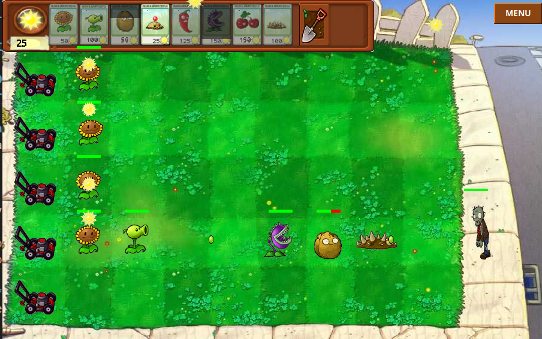
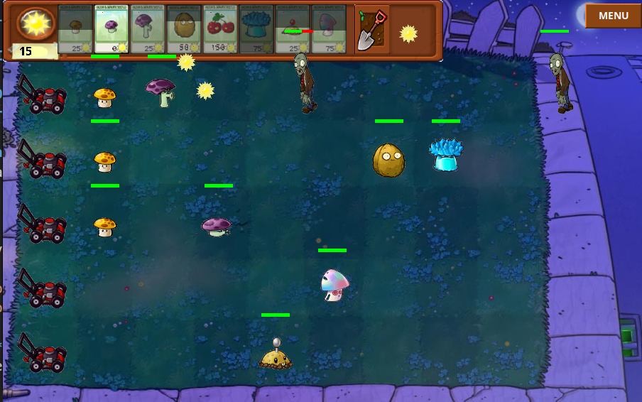

# Plants vs Zombies - Java Edition

## Details

**Created by:
[Nguyen Tri Nhan](https://github.com/Teru127), [Nguyen Le Hoang Long](https://github.com/longnguyen9030) and [Thai Nhat Anh](https://github.com/thainhatanh61-lang)**

This is a clone of the strategy video game, [Plants vs. Zombies](https://en.wikipedia.org/wiki/Plants_vs._Zombies), originally developed by PopCap Games.

Made as a part of final project in Object-Oriented Programming course at International University - VNUHCM.

A classic "Plants vs Zombies" tower defense game developed in "Java Swing".

## 🚀 Features

### 🌻 Dynamic Gameplay
- **Authentic 9x5 Yard Layout**: Experience the classic tower defense grid.
- **Sun Economy System**: Collect falling sun and sunflowers to fuel your defenses.
- **Lawn Mower Defense**: Last-line-of-defense automatic mowers to clear lanes.
- **Shovel Tool**: Reposition your strategy by removing plants.
- **Smooth Animations**: Frame-based sprite animations for a polished feel.

### 🌿 Diverse Plant Arsenal
- **Peashooter**: Your basic long-range attacker.
- **Sunflower**: Essential for generating sun.
- **Wall-nut**: High-durability shield to stall zombies.
- **Potato Mine**: Explosive trap that packs a punch.
- **Cherry Bomb**: Immediate area-of-effect explosion.
- **Chomper**: Devours zombies whole (needs time to chew!).
- **Hypno-shroom**: Turns enemies into allies to fight for you.
- **Ice-shroom**: Freezes all zombies on screen temporarily.
- **Jalapeno**: Destroys an entire lane of zombies.
- **Spikeweed**: Deals damage to zombies walking over it.
- **Sun-shroom & Mushroom Shooter**: Specialized night-time defenders.

### 🧟 Formidable Zombie Horde
- **Normal Zombie**: The standard garden variety.
- **Conehead Zombie**: Extra protection with a traffic cone.
- **Buckethead Zombie**: Extremely durable with a metal bucket.
- **Flag Zombie**: Leads the wave at higher speeds.
- **Newspaper Zombie**: Becomes enraged once his paper is destroyed.
- **Pole Vaulting Zombie**: Jumps over your first line of defense.

### 🖥️ User Interface
- **Thematic Main Menu**: Beautifully designed start screen with Play/Exit.
- **In-Game Overlay**: Accessible "MENU" button to pause or exit anytime.
- **Game Over States**: Clear win/loss conditions with quick restart options.

## 📸 In-game Screenshots

| Day Level | Night Level |
| :---: | :---: |
|  |  |

## How to Play
4. Run the game using the provided script:
```bash
   ./run.sh
```
   Alternatively, run directly with Java:
```bash
   javac -d out src/*.java
   java -cp out Main
```
   > **Note:** Ensure you are in the project root directory so that the `resources/` folder is accessible.


